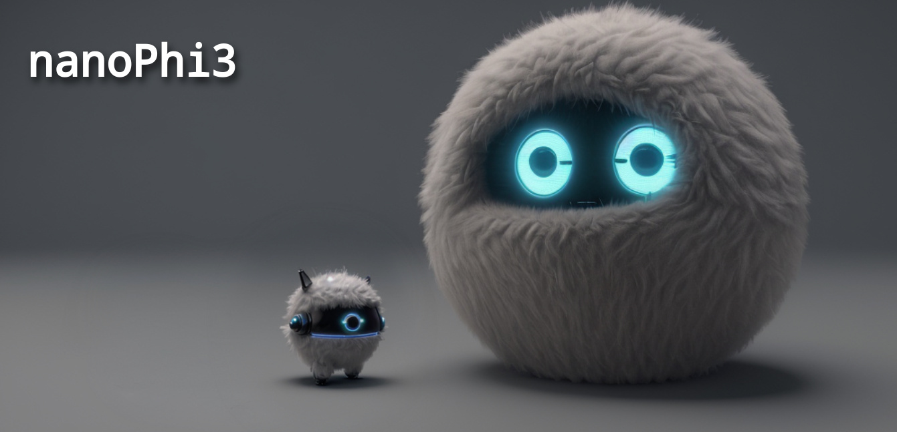

# nanoPhi3




NanoPhi3 is a customized fork of the [nanoGPT](https://github.com/karpathy/nanoGPT) project by Andrej Karpathy.

The goal of this project is to provide a small environment to pre-train a language model based on the [Phi3](https://huggingface.co/docs/transformers/main/model_doc/phi3) model architecture.

In contrast to the `nanoGPT` project does this project make use of transformers for training and model setup.

> NOTE: This project is a WIP and still under development. And training loss is currently not reported. I'm sharing this state on GitHub to get feedback and to improve the implementation.

## Issues

* Training loss is currently not being reported due to a bug
* flash-attn seems not to be used correctly

## OS / Python deps

```bash
# Don't use pyhton 3.12 (Dynamo, torch compile not yet supported)
apt-get install python3.11-dev nvidia-cuda-dev
```

## Setup pyhton env

```bash
python3.11 -m venv venv
. venv/bin/activate
pip install torch transformers wheel datasets wandb
pip install -U flash-attn --no-build-isolation
```

## Prepare Dataset

The prepare script will tokenize the dataset and store the data as `.bin` files.

```bash
python data/kleiner_astronaut/prepare_phi3.py
```

## Train

```bash
export CUDA_LAUNCH_BLOCKING=1 
export CUDA_VISIBLE_DEVICES=0
python phi3/train_phi3.py config/train_kleiner_astronaut_phi3.py
```

Dependencies:

- [pytorch](https://pytorch.org) 
- [numpy](https://numpy.org/install/) 
-  `transformers` for huggingface transformers (to load Phi3 checkpoints, setup model arch)
-  `flash-attn` for the Phi3 attention head implementation
-  `datasets` for huggingface datasets (if you want to download + preprocess OpenWebText)
-  `wandb` for optional logging
-  `tqdm` for progress bars

